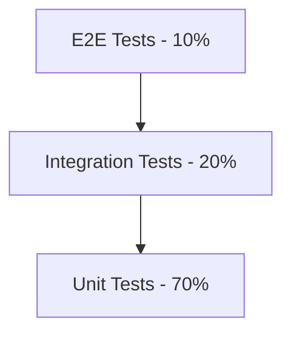

# ChatGenius Testing Strategy

## 1. Testing Strategy Overview

### 1.1 Test Pyramid Structure



| Layer | Coverage Target | Tools |
|-------|----------------|-------|
| E2E | 60% | Playwright |
| Integration | 80% | Jest + MSW |
| Unit | 90% | Jest + Testing Library |

### 1.2 Coverage Requirements

```typescript
// jest.config.js
module.exports = {
  collectCoverageFrom: [
    'src/**/*.{ts,tsx}',
    '!src/**/*.stories.{ts,tsx}',
    '!src/**/*.test.{ts,tsx}',
    '!src/types/**/*'
  ],
  coverageThreshold: {
    global: {
      statements: 80,
      branches: 80,
      functions: 80,
      lines: 80
    },
    './src/components/': {
      statements: 90,
      branches: 90
    },
    './src/lib/': {
      statements: 95,
      branches: 95
    }
  }
};
```

## 2. Test Templates Library

### 2.1 Unit Test Templates

#### React Component Test Template

```typescript
import { render, screen, fireEvent, waitFor } from '@testing-library/react'
import { vi } from 'vitest'
import { ComponentName } from './ComponentName'

describe('ComponentName', () => {
  const defaultProps = {
    // Define default props
  }

  beforeEach(() => {
    vi.clearAllMocks()
  })

  it('should render successfully', () => {
    render(<ComponentName {...defaultProps} />)
    expect(screen.getByRole('main')).toBeInTheDocument()
  })

  it('should handle user interactions', async () => {
    const onAction = vi.fn()
    render(<ComponentName {...defaultProps} onAction={onAction} />)

    const trigger = screen.getByRole('button')
    await fireEvent.click(trigger)

    expect(onAction).toHaveBeenCalledTimes(1)
  })

  it('should handle async operations', async () => {
    render(<ComponentName {...defaultProps} />)

    await waitFor(() => {
      expect(screen.getByText('Loaded')).toBeInTheDocument()
    })
  })

  it('should handle error states', async () => {
    vi.spyOn(console, 'error').mockImplementation(() => {})
    render(<ComponentName {...defaultProps} hasError />)

    expect(screen.getByText('Error')).toBeInTheDocument()
  })
})
```

#### Custom Hook Test Template

```typescript
import { renderHook, act } from '@testing-library/react'
import { useCustomHook } from './useCustomHook'

describe('useCustomHook', () => {
  beforeEach(() => {
    vi.clearAllMocks()
  })

  it('should initialize with default values', () => {
    const { result } = renderHook(() => useCustomHook())
    expect(result.current.value).toBe(initialValue)
  })

  it('should update state correctly', () => {
    const { result } = renderHook(() => useCustomHook())

    act(() => {
      result.current.update('new value')
    })

    expect(result.current.value).toBe('new value')
  })

  it('should handle async operations', async () => {
    const { result } = renderHook(() => useCustomHook())

    await act(async () => {
      await result.current.fetchData()
    })

    expect(result.current.data).toBeDefined()
  })

  it('should cleanup resources', () => {
    const { unmount } = renderHook(() => useCustomHook())
    const cleanup = vi.fn()
    
    unmount()
    expect(cleanup).toHaveBeenCalled()
  })
})
```

### 2.2 Integration Test Templates

#### API Integration Test Template

```typescript
import { setupServer } from 'msw/node'
import { rest } from 'msw'
import { render, screen, waitFor } from '@testing-library/react'
import { ApiComponent } from './ApiComponent'

const server = setupServer(
  rest.get('/api/data', (req, res, ctx) => {
    return res(
      ctx.status(200),
      ctx.json({ data: 'test' })
    )
  })
)

describe('API Integration', () => {
  beforeAll(() => server.listen())
  afterEach(() => server.resetHandlers())
  afterAll(() => server.close())

  it('should fetch and display data', async () => {
    render(<ApiComponent />)

    await waitFor(() => {
      expect(screen.getByText('test')).toBeInTheDocument()
    })
  })

  it('should handle API errors', async () => {
    server.use(
      rest.get('/api/data', (req, res, ctx) => {
        return res(ctx.status(500))
      })
    )

    render(<ApiComponent />)

    await waitFor(() => {
      expect(screen.getByText('Error')).toBeInTheDocument()
    })
  })
})
```

#### WebSocket Integration Test Template

```typescript
import { render, screen, waitFor } from '@testing-library/react'
import WS from 'jest-websocket-mock'
import { ChatComponent } from './ChatComponent'

describe('WebSocket Integration', () => {
  let ws: WS
  
  beforeEach(async () => {
    ws = new WS('ws://localhost:1234')
  })

  afterEach(() => {
    WS.clean()
  })

  it('should establish connection and handle messages', async () => {
    render(<ChatComponent />)
    
    await ws.connected
    ws.send(JSON.stringify({ type: 'message', content: 'test' }))

    await waitFor(() => {
      expect(screen.getByText('test')).toBeInTheDocument()
    })
  })

  it('should handle reconnection', async () => {
    render(<ChatComponent />)
    
    await ws.connected
    ws.close()
    
    await waitFor(() => {
      expect(screen.getByText('Reconnecting')).toBeInTheDocument()
    })

    ws = new WS('ws://localhost:1234')
    await ws.connected

    expect(screen.getByText('Connected')).toBeInTheDocument()
  })
})
```

### 2.3 E2E Test Templates

#### User Flow Test Template

```typescript
import { test, expect } from '@playwright/test'

test.describe('User Flow', () => {
  test.beforeEach(async ({ page }) => {
    await page.goto('/')
  })

  test('complete user journey', async ({ page }) => {
    // Login
    await page.fill('[data-testid="email"]', 'test@example.com')
    await page.fill('[data-testid="password"]', 'password')
    await page.click('[data-testid="login-button"]')
    
    // Create group
    await page.click('[data-testid="create-group"]')
    await page.fill('[data-testid="group-name"]', 'Test Group')
    await page.click('[data-testid="save-group"]')
    
    // Send message
    await page.fill('[data-testid="message-input"]', 'Hello')
    await page.click('[data-testid="send-message"]')
    
    // Verify
    await expect(page.locator('[data-testid="message"]')).toContainText('Hello')
  })
})
```

### 2.4 Performance Test Templates

#### Load Test Template

```typescript
import { check } from 'k6'
import http from 'k6/http'

export const options = {
  stages: [
    { duration: '1m', target: 100 }, // Ramp up
    { duration: '3m', target: 100 }, // Stay
    { duration: '1m', target: 0 }    // Ramp down
  ],
  thresholds: {
    http_req_duration: ['p(95)<500'], // 95% under 500ms
    http_req_failed: ['rate<0.01']    // Less than 1% errors
  }
}

export default function () {
  const res = http.get('http://localhost:3000/api/messages')
  
  check(res, {
    'status is 200': (r) => r.status === 200,
    'response time OK': (r) => r.timings.duration < 500
  })
}
```

## 3. Test Scenarios Framework

### 3.1 Authentication Flow

```typescript
describe('Authentication Flow', () => {
  const scenarios = [
    {
      name: 'successful login',
      credentials: { email: 'valid@example.com', password: 'valid' },
      expectedResult: { success: true, redirect: '/dashboard' }
    },
    {
      name: 'invalid credentials',
      credentials: { email: 'valid@example.com', password: 'invalid' },
      expectedResult: { success: false, error: 'Invalid credentials' }
    },
    {
      name: 'account locked',
      credentials: { email: 'locked@example.com', password: 'valid' },
      expectedResult: { success: false, error: 'Account locked' }
    }
  ]

  scenarios.forEach(scenario => {
    it(`should handle ${scenario.name}`, async () => {
      const result = await authenticate(scenario.credentials)
      expect(result).toMatchObject(scenario.expectedResult)
    })
  })
})
```

### 3.2 Message Handling

```typescript
describe('Message Handling', () => {
  const messageScenarios = [
    {
      name: 'text message',
      input: { type: 'text', content: 'Hello' },
      validation: (message: Message) => {
        expect(message.type).toBe('text')
        expect(message.content).toBe('Hello')
      }
    },
    {
      name: 'long message',
      input: { type: 'text', content: 'a'.repeat(5000) },
      validation: (message: Message) => {
        expect(message.content.length).toBeLessThanOrEqual(4000)
        expect(message.truncated).toBe(true)
      }
    },
    {
      name: 'empty message',
      input: { type: 'text', content: '' },
      expectError: true
    }
  ]

  messageScenarios.forEach(scenario => {
    it(`should handle ${scenario.name}`, async () => {
      if (scenario.expectError) {
        await expect(sendMessage(scenario.input)).rejects.toThrow()
      } else {
        const result = await sendMessage(scenario.input)
        scenario.validation(result)
      }
    })
  })
})
```

## 4. Quality Gates

### 4.1 Coverage Gates

```typescript
// scripts/quality-gates.ts
interface QualityGate {
  metric: string
  threshold: number
  actual: number
  pass: boolean
}

async function checkQualityGates(): Promise<boolean> {
  const gates: QualityGate[] = [
    {
      metric: 'test-coverage',
      threshold: 80,
      actual: await getCoverage(),
      pass: false
    },
    {
      metric: 'e2e-success',
      threshold: 100,
      actual: await getE2ESuccess(),
      pass: false
    },
    {
      metric: 'performance-score',
      threshold: 90,
      actual: await getPerformanceScore(),
      pass: false
    }
  ]

  gates.forEach(gate => {
    gate.pass = gate.actual >= gate.threshold
  })

  return gates.every(g => g.pass)
}
```

### 4.2 Performance Gates

```typescript
// scripts/performance-gates.ts
interface PerformanceMetrics {
  ttfb: number;        // Time to First Byte
  fcp: number;         // First Contentful Paint
  lcp: number;         // Largest Contentful Paint
  cls: number;         // Cumulative Layout Shift
  tti: number;         // Time to Interactive
}

const performanceThresholds: Record<keyof PerformanceMetrics, number> = {
  ttfb: 100,   // 100ms
  fcp: 1000,   // 1s
  lcp: 2500,   // 2.5s
  cls: 0.1,    // 0.1
  tti: 3500    // 3.5s
}

async function checkPerformanceGates(metrics: PerformanceMetrics): Promise<boolean> {
  return Object.entries(metrics).every(([key, value]) => {
    return value <= performanceThresholds[key as keyof PerformanceMetrics]
  })
}
```

## 5. Testing Tools Setup

### 5.1 Jest Configuration

```typescript
// jest.setup.ts
import '@testing-library/jest-dom'
import { server } from './mocks/server'

beforeAll(() => server.listen())
afterEach(() => server.resetHandlers())
afterAll(() => server.close())

// Mock IntersectionObserver
global.IntersectionObserver = class IntersectionObserver {
  constructor() {}
  observe() { return null }
  unobserve() { return null }
  disconnect() { return null }
}

// Mock ResizeObserver
global.ResizeObserver = class ResizeObserver {
  constructor() {}
  observe() { return null }
  unobserve() { return null }
  disconnect() { return null }
}
```

### 5.2 Playwright Configuration

```typescript
// playwright.config.ts
import { PlaywrightTestConfig } from '@playwright/test'

const config: PlaywrightTestConfig = {
  testDir: './e2e',
  use: {
    baseURL: 'http://localhost:3000',
    trace: 'retain-on-failure',
    screenshot: 'only-on-failure'
  },
  projects: [
    {
      name: 'Chrome',
      use: { browserName: 'chromium' }
    },
    {
      name: 'Firefox',
      use: { browserName: 'firefox' }
    },
    {
      name: 'Safari',
      use: { browserName: 'webkit' }
    }
  ]
}

export default config
```

## 6. Test Data Management

### 6.1 Test Data Generation

```typescript
// test/factories/user.ts
import { faker } from '@faker-js/faker'
import { User } from '@/types/models/user'

export function createUser(overrides?: Partial<User>): User {
  return {
    id: faker.string.uuid(),
    name: faker.person.fullName(),
    email: faker.internet.email(),
    createdAt: faker.date.recent(),
    ...overrides
  }
}

// test/factories/message.ts
export function createMessage(overrides?: Partial<Message>): Message {
  return {
    id: faker.string.uuid(),
    content: faker.lorem.sentence(),
    userId: faker.string.uuid(),
    createdAt: faker.date.recent(),
    ...overrides
  }
}
```

### 6.2 Database Seeding

```typescript
// test/seed/index.ts
import { prisma } from '@/lib/prisma'
import { createUser, createMessage } from '../factories'

export async function seedTestData() {
  const users = await Promise.all(
    Array.from({ length: 5 }).map(() => 
      prisma.user.create({ data: createUser() })
    )
  )

  const messages = await Promise.all(
    users.flatMap(user =>
      Array.from({ length: 3 }).map(() =>
        prisma.message.create({
          data: createMessage({ user.id })
        })
      )
    )
  )

  return { users, messages }
}
```

## 7. Test Automation

### 7.1 GitHub Actions Integration

```yaml
# .github/workflows/test.yml
name: Test

on:
  push:
    branches: [main]
  pull_request:
    branches: [main]

jobs:
  test:
    runs-on: ubuntu-latest
    steps:
      - uses: actions/checkout@v2
      
      - name: Setup Node.js
        uses: actions/setup-node@v2
        with:
          node-version: '18'
          
      - name: Install dependencies
        run: npm ci
        
      - name: Run linter
        run: npm run lint
        
      - name: Run unit tests
        run: npm run test:unit
        
      - name: Run integration tests
        run: npm run test:integration
        
      - name: Run E2E tests
        run: npm run test:e2e
        
      - name: Upload coverage
        uses: codecov/codecov-action@v2
```

## 8. Best Practices

1. **Test Organization:**
   - Group tests logically
   - Use descriptive test names
   - Follow AAA pattern (Arrange-Act-Assert)

2. **Test Isolation:**
   - Reset state between tests
   - Mock external dependencies
   - Use test databases

3. **Test Maintenance:**
   - Keep tests simple and focused
   - Avoid test interdependence
   - Regular test cleanup

4. **Performance:**
   - Run tests in parallel when possible
   - Mock heavy operations
   - Use test timeouts wisely

Remember to:
1. Write tests before code (TDD)
2. Keep coverage high
3. Review test code like production code
4. Update tests when requirements change 